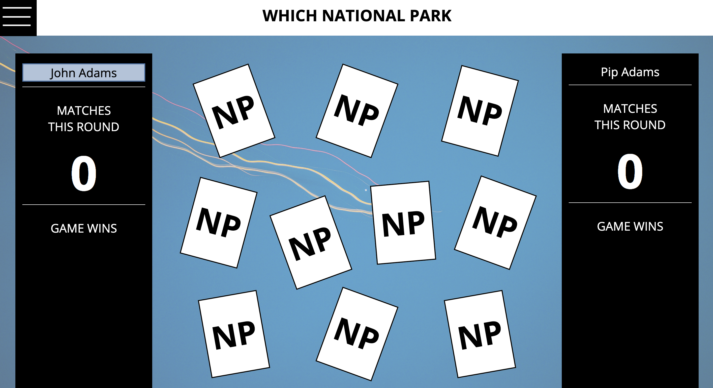
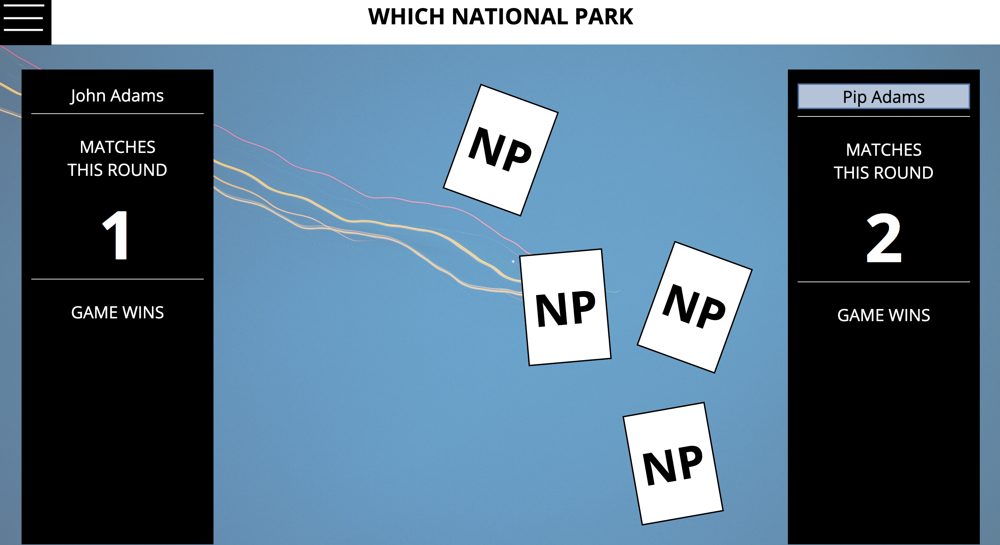
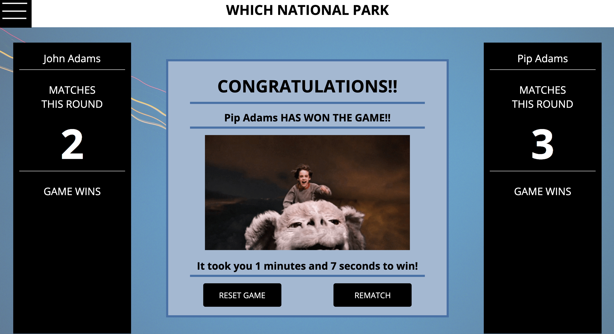
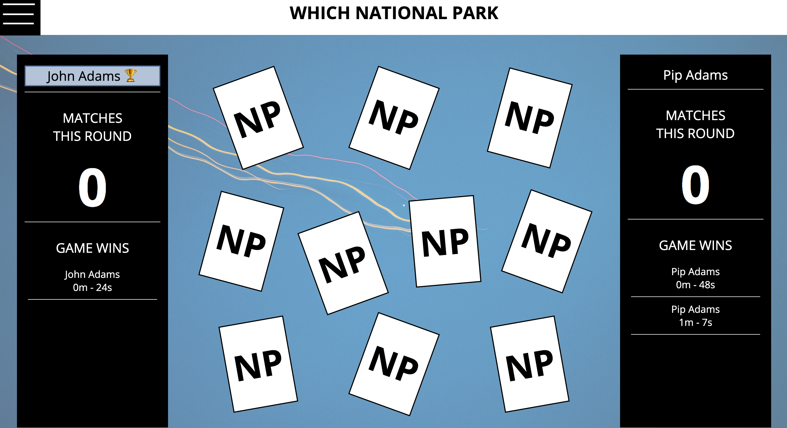

# Mod-1 Solo Project - Memory Card Game

Site:  https://adamsjr8576.github.io/Mod1_Project4_Beyonce/

## Table of Contents

* [General Info](#General-Info)
* [Background](#Background)
* [Built With](#Built-With)
* [Screenshots](#Screenshots)
* [How to Use](#How-to-Use)
* [Features](#Features)
* [Setup](#Setup)
* [License](#License)

## General-Info

The purpose for this project was to implement the cumulative knowledge and skills we have learned throughout Mod 1 at Turing in a single overarching project. This project focused on fine tuning our ability to handle and manipulate complex data types such as arrays and objects via tools like array prototype methods and classes. Coupling these skills with knowledge of local storage made it possible to have a game and date persist on page load. As I final solo project the project is meant to reflect our skillset and current knowledge and place within Mod 1.

## Background

For the project, we were given a static visual comp, but then also given the freedom to create and use our own content and theme for the project. The game is based off of the classic memory card game - where cards are randomly shuffled and laid face down. The player then gets to flip over two cards for a select amount of time before flipping them back over. if you get a pair then you get a point and the player with the most pairs wins.

Behaviors:

- There must be two player names inputted in order to move on to the instructions page. 

- Read the instructions page and then select play game to initiate gameplay.

- 10 cards are displayed at random that represents 5 pairs.

- PLayer that goes first is higlighted in blue

- Whoever's turn it is then selects two cards that flip to the photo side for 2 seconds before automatically flipping back. They can only select two at a time. If it is a match then the matched cards dissappear and that players matches increases by one.

- One all 5 matches are made the player with the most matches wins the game and is rewarded with a Congrats message.

- The players then have the option to start over - which brings them back to the player input state OR rematch where their information is kept and the cards are reshuffled and they are brought back to the gameplay state.

## Built-With

- HTML5
- CSS3
- JavaScript

## Screenshots

## How-to-Use

- There must be two player names inputted in order to move on to the instructions page. 

- Read the instructions page and then select play game to initiate gameplay.

- 10 cards are displayed at random that represents 5 pairs.

- PLayer that goes first is higlighted in blue

- Whoever's turn it is then selects two cards that flip to the photo side for 2 seconds before automatically flipping back. They can only select two at a time. If it is a match then the matched cards dissappear and that players matches increases by one.

- One all 5 matches are made the player with the most matches wins the game and is rewarded with a Congrats message.

- The players then have the option to start over - which brings them back to the player input state OR rematch where their information is kept and the cards are reshuffled and they are brought back to the gameplay state.

## Features

- [x] game viable for two players
- [x] nav icon contains the top 5 players based on game time. persists on page load.
- [x] if a player is in the top 5 a trophy is next to their name.
- [x] if a player has won befor that information is stored beneath their name
- [x] the game tracks the gameplay time
- [x] you can reset game or restart game at the end of each round.
- [x] there are 10 photos (20 potential cards) that are cycled through each game for greater difficulty

## Setup

Access the site... coming soon

## License

Credit for project specs and web design goes to Turing School of Software and Design.
